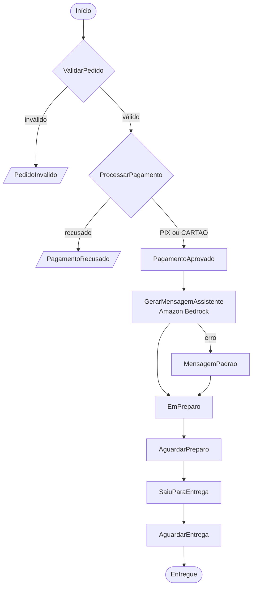
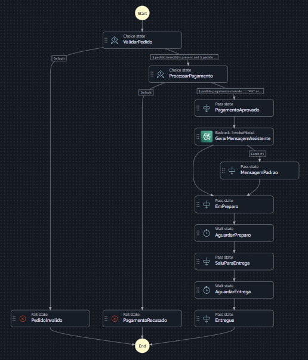
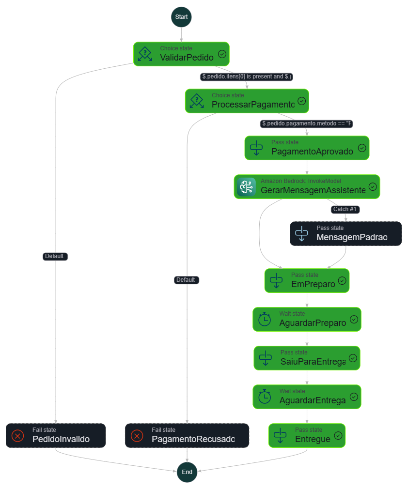
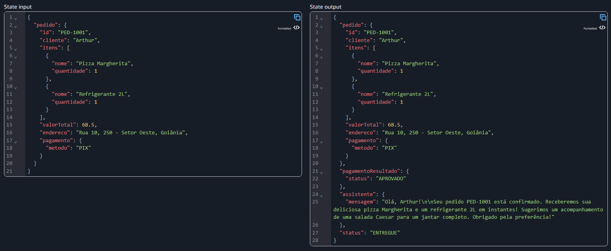
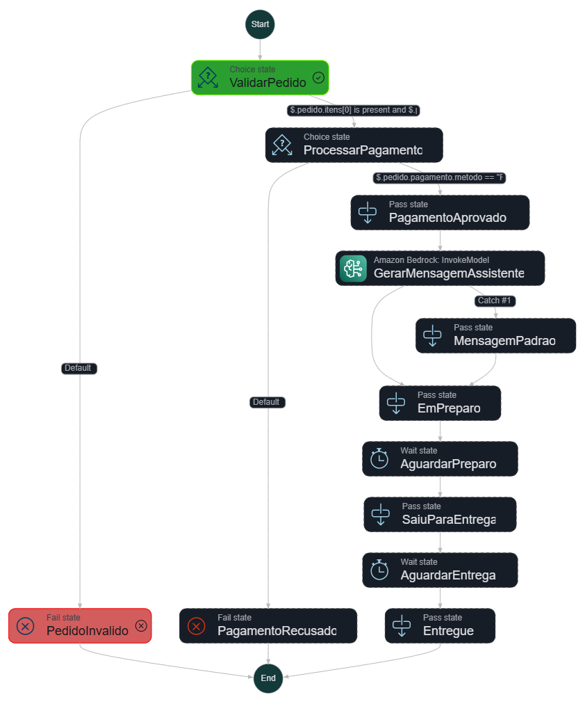
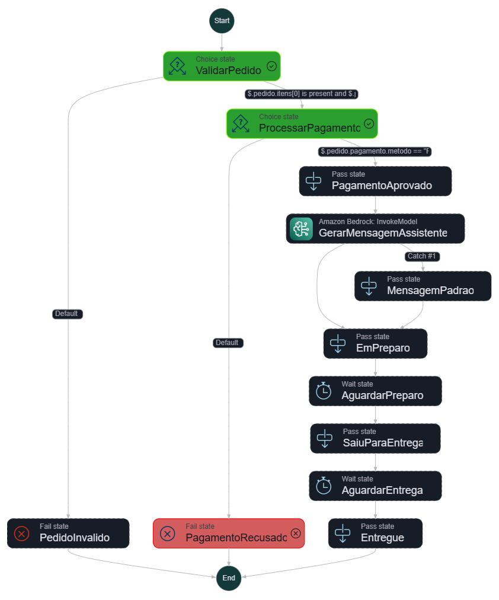

# Assistente de Delivery com AWS Step Functions e Amazon Bedrock

Desafio prático do curso **Nublify - Primeiros passos em IA e Cloud**, da [DIO](https://www.dio.me/).

O projeto orquestra o fluxo de um pedido de delivery, da validação até a entrega, usando uma máquina de estados do AWS Step Functions. O Amazon Bedrock entra no meio do fluxo para gerar uma mensagem de confirmação personalizada para o cliente, com uma sugestão de acompanhamento baseada nos itens do pedido.

## Arquitetura



| Estado | Tipo | O que faz |
| --- | --- | --- |
| `ValidarPedido` | Choice | Exige ao menos um item, endereço e valor total maior que zero |
| `ProcessarPagamento` | Choice | Simula o gateway de pagamento: aprova `PIX` e `CARTAO` |
| `PagamentoAprovado` | Pass | Registra o resultado do pagamento na saída |
| `GerarMensagemAssistente` | Task | Chama o Bedrock (`bedrock:invokeModel`) para escrever a mensagem ao cliente |
| `MensagemPadrao` | Pass | Fallback: usa um texto fixo se o Bedrock falhar |
| `EmPreparo`, `SaiuParaEntrega`, `Entregue` | Pass | Atualizam o campo `status` do pedido |
| `AguardarPreparo`, `AguardarEntrega` | Wait | Simulam o tempo de preparo e de entrega (5 s cada) |
| `PedidoInvalido`, `PagamentoRecusado` | Fail | Encerram a execução com erro nomeado |

## Serviços utilizados

- **AWS Step Functions** (workflow Standard): orquestração do fluxo.
- **Amazon Bedrock** (modelo Amazon Nova Lite): geração da mensagem personalizada.
- **AWS IAM**: role de execução com permissão `bedrock:InvokeModel`.

A validação e o pagamento usam apenas estados nativos do Step Functions, sem Lambda. Isso deixa o projeto mais simples de reproduzir e com custo próximo de zero.

## Como reproduzir

1. No console da AWS, selecione a região **us-east-1** (N. Virginia).
2. No Amazon Bedrock, abra o playground com o modelo **Nova Lite** e envie uma mensagem de teste para confirmar o acesso.
3. No Step Functions, crie uma máquina de estados em branco do tipo **Standard**.
4. Na aba **Code**, cole o conteúdo de [`assistente-delivery.asl.json`](./assistente-delivery.asl.json).
5. Salve e deixe o console criar a role de execução.
6. Clique em **Start execution** e informe uma das entradas abaixo.

## Testes

### Pedido válido

```json
{
  "pedido": {
    "id": "PED-1001",
    "cliente": "Arthur",
    "itens": [
      { "nome": "Pizza Margherita", "quantidade": 1 },
      { "nome": "Refrigerante 2L", "quantidade": 1 }
    ],
    "valorTotal": 68.5,
    "endereco": "Rua 10, 250 - Setor Oeste, Goiânia",
    "pagamento": { "metodo": "PIX" }
  }
}
```

Resultado esperado: execução concluída com `status` igual a `ENTREGUE` e a mensagem gerada pela IA em `assistente.mensagem`.

### Pedido inválido

Mesma entrada, trocando os itens por uma lista vazia:

```json
"itens": []
```

Resultado esperado: execução encerrada no estado `PedidoInvalido`.

### Pagamento recusado

Mesma entrada, trocando o método de pagamento:

```json
"pagamento": { "metodo": "BOLETO" }
```

Resultado esperado: execução encerrada no estado `PagamentoRecusado`.

## Resultados

<!-- Salve os prints na pasta images/ com estes nomes -->

**Grafo da máquina de estados**



**Execução com sucesso**



**Mensagem gerada pelo Bedrock**



**Caminhos de erro**




## Solução de problemas

Se o Bedrock falhar, a execução não é interrompida: o fluxo segue com a mensagem padrão e o erro fica registrado no campo `erroBedrock` da saída.

O erro mais comum é o modelo exigir um perfil de inferência. Nesse caso:

- Troque o `ModelId` para `us.amazon.nova-lite-v1:0`.
- Adicione o ARN do perfil à role de execução, além do modelo base:
  `arn:aws:bedrock:us-east-1:<ID_DA_CONTA>:inference-profile/us.amazon.nova-lite-v1:0`

## Aprendizados

<!-- Ajuste esta seção com as suas próprias palavras -->

- **Orquestração declarativa**: o fluxo inteiro é descrito em JSON (Amazon States Language), e a AWS cuida da execução, das transições e do histórico de cada passo.
- **Nem tudo precisa de Lambda**: estados `Choice`, `Pass` e `Wait` resolvem regras simples sem escrever nem manter código.
- **Integração direta com IA**: o Step Functions chama o Bedrock sem intermediários, e funções intrínsecas como `States.Format` montam o prompt com os dados do pedido.
- **Resiliência**: `Retry` e `Catch` fazem a IA ser um complemento, não um ponto único de falha. Se o modelo não responder, o pedido é entregue do mesmo jeito.
- **Menor privilégio**: a role de execução só tem a permissão de invocar o modelo usado.

## Próximos passos

- Substituir a simulação de pagamento por uma função Lambda integrada a um gateway real.
- Salvar os pedidos e o histórico de status no DynamoDB.
- Notificar o cliente a cada mudança de status com o Amazon SNS.
- Expor o início do fluxo por uma API no API Gateway.

## Limpeza

Para não deixar recursos na conta, exclua a máquina de estados e a role de execução criada pelo console.

## Autor

**Arthur Mamedes Borges** - [@A4thu4](https://github.com/A4thu4)
